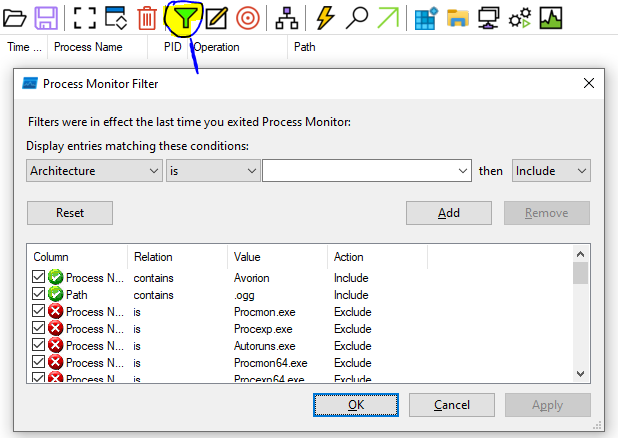

# Avorion soundtrack generator
A simple python script, that generates the neseccary music.lua, to include your own .ogg music files.
It relies on ffmpeg and ffprobe to check the quality of the .ogg files

There is the option to add your own music to the original tracks or exclude the original tracks and only have your own. The original tracks may still play in your spawn/home sector.

You will have to travel outside your home sector for the new music to kick in.


## Requirements for .ogg files
* Should be in .ogg (vorbis) format
* The first stream in the file should be the audio track - will crash if not
* Should have a samplerate of at least 44100


## Folder structure and description of each folder and mood it represents
When it's first run, it will generate the PersonalAvorionSoundtrack folder and in it this folder structure:
↳ data
  ↳ music
    ↳ action: Combat music - MUST be called combat0.ogg, combat1.ogg, combat2.ogg etc. - unsure if it supports above 9
    ↳ background: music put in the background folder, will be put in the category called 'All'
      ↳ Befog: slow, thoughtful, hint of melancholy
      ↳ BehindStorms: Slow, hint of melancholy, hint of eerie
      ↳ Beyond: slow, homesick, hint of melancholy
      ↳ BlindingNebula: Slow, uplifting
      ↳ Exhale: Slow, relaxing, uplifting
      ↳ Float: Solemn, tempered, relaxed
      ↳ Found: Quiet, ominous
      ↳ HappilyLost: Quiet, fragile, happy
      ↳ Impact: Quiet, brooding, thoughtful
      ↳ InSight: Quiet, relaxed
      ↳ Interim: Relaxed, just chilling, neutral to happy
      ↳ LightDance: Adventurous, upbeat
      ↳ LongForgotten: Quiet, longing, hint of melancholy
      ↳ Particle: Happy, relaxed
    ↳ menu: Start menu music - MUST be called title.ogg

I've tried to listed to each of the existing track in the game, and then put some feelings to it.
The idea is that you will put your new track, inside each of those folders, that have more or less the same "feel" to it

The script will then put the new tracks, in the same music categorys as the existing tracks, hoping it will fit the mood of whatever is happening.


### Highlighting problematic audio files
When all tracks have been processed, an list of potentially problematic files will be shown along with a description of issues.

Files that have comments with !!! in front of it, will likely crash Avorion when the game tries to play the track, unless handled.

The game has a problem playing ogg files, that have multiples streams and the first stream isn't the audio - this will result in the game hanging/crashing

```
The following tracks have possible issues:
data/music/background\Befog\Starport 01.ogg
 - has more than 1 stream but the first stream IS an audio track, it may still work - found 2 streams - may cause crashing when being played
data/music/background\Float\Floating.ogg
 - has more than 1 stream but the first stream IS an audio track, it may still work - found 2 streams - may cause crashing when being played
data/music/background\Interim\Ursa Major.ogg
 !!! has more than 1 stream and the first stream IS NOT an audio track - found 2 streams - will likely cause crashing when being played
data/music/background\Interim\FederalStarport.ogg
 !!! has more than 1 stream and the first stream IS NOT an audio track - found 2 streams - will likely cause crashing when being played
data/music/background\Interim\SystemMap02.ogg
 - has more than 1 stream but the first stream IS an audio track, it may still work - found 2 streams - may cause crashing when being played
```

## Installation of mod
Copy the folder PersonalAvorionSoundtrack folder, to %AppData%\Avorion\mods and enable it in your game.
If it's an existing game, you will have to edit your  %AppData%\Avorion\galaxies\<gamename>\modconfig.lua and add something like this, to the mods list

``
 {path = "C:\\Users\\<yourusename>\\AppData\\Roaming\\Avorion\\mods\\PersonalAvorionSoundtrack"},
``

## Known issues
#### Crashing/stalling because of wrongly formatted .ogg files
Some wrongly formatted/converted ogg files, may not be caught by the checks done by the script and could still cause Avorion to hang/crash

On Windows, I advise you to use Process Monitor https://learn.microsoft.com/en-us/sysinternals/downloads/procmon to see what file it was last trying to access, before crashing and then convert it using a different service/programme. The last .ogg being opening in filemon could be the culprit.

Here are my settings used:

Only show/enable File System Activity


You should set up the filter to only show Avorion and file paths containing .ogg


I've had success using https://audio.online-convert.com/convert-to-ogg to convert my problematic .ogg file through, without touching any settings - just pressing start and overwriting the original file
